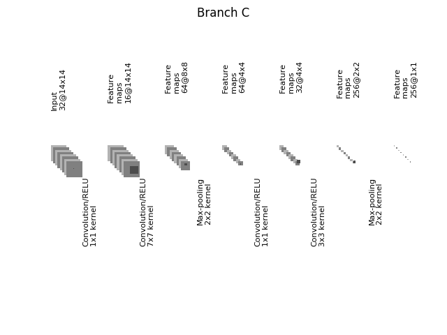
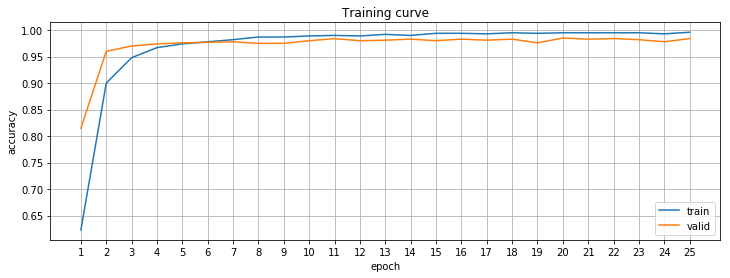

## Build a Traffic Sign Recognition Project

The goals / steps of this project are the following:
* Load the data set (see below for links to the project data set)
* Explore, summarize and visualize the data set
* Design, train and test a model architecture
* Use the model to make predictions on new images
* Analyze the soft-max probabilities of the new images
* Summarize the results with a written report

---
### Data Set Summary & Exploration
#### Basic summary of the data set

I used the numpy/built-in functions to calculate summary statistics of the
traffic signs data set.

* The size of training set is - 34799 images
* The final size of training set is - 257832 images
* The size of the validation set is - 4410 images
* The size of test set is - 12630 images
* The shape of a traffic sign image is - 32x32x3
* The number of unique classes/labels in the data set is - 43

#### Visualization of the dataset

[distribution]: ./images/distribution.png "Traffic signs distribution"
[eq_distribution]: ./images/equalized.distribution.png "Traffic signs distribution after equalization"
[original]: ./images/train.original.png "Sample of original training set images"
[processed]: ./images/train.processed.png "Sample of processed training set images"

Here is an exploratory visualization of the data set. It is a bar chart showing
how the data is distributed between classes for each set.

![alt text][distribution]

Train set distribution after category equalization (factor 0.33), see details
below.

![alt text][eq_distribution]

Random sample of 4 images taken from training set from each category.

![alt text][original]

### Design and Test a Model Architecture
#### Image preprocessing

[grayscale]: ./images/grayscale.png "grayscale"
[contrast_low]: ./images/contrast_low.png "contrast low"
[contrast_high]: ./images/contrast_high.png "contrast high"
[normalization]: ./images/normalize.png "normalization"
[noise]: ./images/noise.png "Gaussian noise"
[brightness_low]: ./images/brightness_low.png "brightness low"
[brightness_high]: ./images/brightness_high.png "brightness high"
[rotation_cw]: ./images/rotate_cw.png "cw rotation"
[rotation_ccw]: ./images/rotate_ccw.png "ccw rotation"
[shift]: ./images/shift.png "shift"

Techniques used in image preprocessing introduced in the table.

|  Technique        |  Sets                      |  Example                   |
|:-----------------:|:--------------------------:|:--------------------------:|
| grayscale         | train, valid, test         | ![alt text][grayscale]     |
| normalization     | train, valid, test         | ![alt text][normalization] |
| adjust contrast   | train, equalization, boost | ![alt text][contrast_low] ![alt text][contrast_high] |
| gaussian noise    | train, boost               | ![alt text][noise]         |
| rotation/scale    | equalization, boost        | ![alt text][rotation_ccw] ![alt text][rotation_cw]  |
| shift             | equalization, boost        | ![alt text][shift]          |
| adjust brightness | boost                      | ![alt text][brightness_low] ![alt text][brightness_high] |

##### Grayscale
I decided to use grayscale images as an input for the neural network.

Pros:
* smaller input - allows bigger batches
* colors could be misleading - may vary depending on light conditions
* system less scalable when depends on color - different country uses different
  color schemas for signs
* better performance mentioned in [1] when using grayscale images
* image processing (eg. normalization, contrast adjustment) simple when
  there is only one channel

Cons:
* some information about image lost

##### Normalization
All images normalized before passing into neural network. Normalization
includes: mean subtraction, mapping pixel values to _[-0.5, 0.5]_ range.
Using features at the same scale usually helps to achieve better training
performance (in terms of time) and accuracy.

##### Contrast adjustment
All images from training set passed through contrast adjustment. Changing
contrast affects "readability" of the sign. Decreasing of contrast usually makes
sign less readable and allows network to learn how to deal with it.

##### Gaussian noise
In addition to previous preprocessing techniques, gaussian noise was added to
all images from training set. This allows network to learn how to deal with
noise which could be part of real image.

##### Rotation/Scale
While performing category equalization and boosting images were rotated and
scaled. This allows network to learn how to deal with such a transformations.
The translation is logical, since in real examples traffic signs could be seen
under different angles.

##### Shift
While performing category equalization and boosting images position was changed.
This allows network to learn how to resist bounding box detection errors.

#### Category equalization
Since some categories (eg. 0, 19, etc.) under represented in data set. Neural
network has less chances to learn how to classify such images. In order to
give network better chance to learn equalization was performed.

By equalization I mean - generation of additional images (from images which
already exist in training set) in order to achieve given distribution.
I described desired distribution with a single parameter - fraction of maximum
(1 - means uniform distribution, 0.5 - means each category should have as many
images as at least half of maximum).

I used factor 0.33 for training the final model.

Generation phase includes the following steps:
  * image shift - _[-1, 1]_ pixels by each axis
  * image rotation/scale - _[-3, 3]_ degrees, scale factor _[0.9, 1.1]_
  * contrast adjustment - factor _[0.9, 1.1]_

Resulting distribution
![alt text][eq_distribution]

#### Additional data
Early experiments shown event simple model tend to overfit, and show poor
performance when regularization used. One technique to deal with such a
problem - generation additional training data.

From each image in training set I generated 5 additional images using the
following algorithm.

* image shift - image positions was randomly changed in range _[-2, 2]_ pixels
  by each axis [1]
* image rotation (including scaling) - images was randomly rotated around center
  in range _[-14, 14]_ degrees, and scaled by factor from _[0.8, 1.2]_ [1]
* brightness adjustment - brightness of the image was randomly adjusted in range
  _[-0.1, 0.1]_ (idea taken from `tensorflow.image.adjust_brightness`)
* contrast adjustment - contrast of the image was randomly adjusted in range
  _[0.85, 1.15]_ (idea taken from `tensorflow.image.adjust_contrast`)
* gaussian noise - already discussed, sigma - _sqrt(3)_

The final size of training set is - 257832 images. Since each images of original
training set was used to produce extra images the distribution remains the same
(note, this happen after equalization, so the distribution is equal to equalized
distribution).

Sample of preprocessed training set shown on the figure below.

![alt text][processed]

#### Model architecture

My final model consisted of the following layers:

| Layer         		      |     Description	                     					|
|:-----------------------:|:---------------------------------------------:|
| Input               		| 32x32x1 RGB image   					             		|
|                         | _**Initial**_                                 |
| Convolution 7x7@8     	| 1x1 stride, same padding, outputs 32x32x8   	|
| RELU					          |                        												|
| Convolution 1x1@4      	| 1x1 stride, valid padding, outputs 32x32x4   	|
| RELU					          |                        												|
| Convolution 5x5@32     	| 1x1 stride, valid padding, outputs 28x28x32  	|
| RELU					          |                        												|
| Max pooling	2x2    	    | 2x2 stride, outputs 14x14x32           				|
|                         | **_Branch A_**                                |
| Convolution 1x1@16     	| 1x1 stride, valid padding, outputs 14x14x16  	|
| RELU					          |                        												|
| Convolution 5x5@128    	| 1x1 stride, valid padding, outputs 10x10x128 	|
| RELU                    |                                               |
| Max pooling	2x2     	  | 2x2 stride, outputs 5x5x128           				|
| Convolution 1x1@64    	| 1x1 stride, valid padding, outputs 5x5x64   	|
| RELU					          |                        												|
| Convolution 3x3@256    	| 1x1 stride, valid padding, outputs 3x3x256  	|
| RELU                    |                                               |
| Max pooling 3x3         | 1x1 stride, outputs 1x1x256                   |
|                         | **_Branch B_**                                |
| Convolution 1x1       	| 1x1 stride, valid padding, outputs 14x14x16  	|
| RELU					          |                        												|
| Convolution 3x3       	| 1x1 stride, valid padding, outputs 12x12x128 	|
| RELU                    |                                               |
| Convolution 1x1       	| 1x1 stride, valid padding, outputs 12x12x32  	|
| RELU					          |                        												|
| Convolution 3x3         | 1x1 stride, valid padding, outputs 10x10x128 	|
| RELU                    |                                               |
| Convolution 1x1       	| 1x1 stride, valid padding, outputs 10x10x32  	|
| RELU					          |                        												|
| Convolution 3x3       	| 1x1 stride, valid padding, outputs 8x8x128  	|
| RELU                    |                                               |
| Max pooling	3x3    	    | 1x1 stride, outputs 6x6x128           				|
| Convolution 1x1       	| 1x1 stride, valid padding, outputs 6x6x64   	|
| RELU					          |                        												|
| Convolution 5x5     	  | 1x1 stride, valid padding, outputs 2x2x256  	|
| RELU                    |                                               |
| Max pooling	2x2    	    | 1x1 stride, outputs 1x1x256           				|
|                         | **_Branch C_**                                |
| Convolution 1x1@16     	| 1x1 stride, valid padding, outputs 14x14x16  	|
| RELU					          |                        												|
| Convolution 7x7@64    	| 1x1 stride, valid padding, outputs 8x8x64    	|
| RELU                    |                                               |
| Max pooling	2x2     	  | 2x2 stride, outputs 4x4x64            				|
| Convolution 1x1@32    	| 1x1 stride, valid padding, outputs 4x4x32   	|
| RELU					          |                        												|
| Convolution 3x3@256    	| 1x1 stride, valid padding, outputs 2x2x256  	|
| RELU                    |                                               |
| Max pooling 2x2         | 2x2 stride, outputs 1x1x256                   |
|                         | **_Concatenation_**                           |
| Dropout                 |                                               |
| Fully connected	768x384 | outputs 384                  									|
| RELU                    |                                               |
| Dropout                 |                                               |
| Fully connected 384x43  | outputs 43                                    |
| Soft-max				        | only applicable for top_k    							  	|

Layers visualization using [3]

#### Training
The space of hyperparameters for the training was wide. Including
*  Dropout values for convolutional and fully connected layers (0.25/0.4)
*  Number of epochs (25)
*  Batch size (1280)
*  Learning rate (0.01)
*  Equalization factor (0.33)
*  Optimizer (Adam)

##### Dropout
Dropout probabilities are important for fighting against overfitting. I did
several experiments with different values and came up with keep probabilities
for:
*  convolutional layer - _0.25_
*  fully connected layer - _0.4_

##### Number of epochs
Experiments shown pretty fast convergence for model. _25_ epochs was enough for
the model to be trained.

##### Batch size
The main criteria for choosing batch size was training performance (in terms of
time). When using GPU for training passing data from RAM to GPU could become a
bottleneck. I performed series of experiments using different batch size and
measuring epoch time. Based on the experiment I choose batch size equals to
_1280_.

##### Learning rate
I picked learning rate small enough to produce acceptable accuracy and big
enough to achieve fast convergence. Several experiments shown _0.001_ is a good
choice.

##### Equalization factor
Training data with uniform distribution might be useful to achieve high
performance. Unfortunately, such kind of training set is not always available.
One could use some kind of equalization technique. However, adding too many
"synthetic" examples could lead to accuracy decrease, since such examples
could not add much variety.
I choose equalization factor equals to _0.33_

##### Optimizer
According to [4] _Adam_ optimizer shows good performance and uses adaptive
learning rate. I choose it as the optimizer for the model.

#### Model discussion
My final model results were:
* training set accuracy of _99.8_
* validation set accuracy of _99.4_
* test set accuracy of _98.4_

Milestones of iterative approach I used are described below.

* What was the first architecture that was tried and why was it chosen?

  The first architecture I've tried was LeNet-5 (adjusted with correct number of
  categories) as suggested in assignment.

* What were some problems with the initial architecture?

  Model tends to overfit on the given training set, so some kind of
  regularization have to be introduced.

* How was the architecture adjusted and why was it adjusted?

  * Dropout was added in order to avoid overfitting
  * Additional layers were added in order to achieve better accuracy
  * Architecture was changed by introducing additional branches of computation
    (check network architecture section). The idea was inspired by [1] and [2].

* Which parameters were tuned? How were they adjusted and why?

  * Depth of layers were tuned in order to find balance between training time
    and accuracy (more variables -> longer training time -> tend to overfit)
  * 1x1 convolutions were added (inspired by [2]) in order to limit number of
    variables
  * Dropout values were tuned in order to mitigate overfitting effectively
  * Different branches combinations were explored

* What are some of the important design choices and why were they chosen?

  * Use convolution layers - seems a good idea for traffic signs classification
    since convolution is about using information about neighboring (kernel)
    features regardless of they position. Traffic sings classification is
    perfect task for convolution layers, since all required information (for
    human brain) is located in very limited area. Position independence is
    another huge plus for the problem, since signs may be rotated in
    3-dimensions or has errors in bounding boxes, so informative area of the
    sign could be almost everywhere.

  * Use branching (inspired by [2]) - technique I was interested to try out. The
    idea is to give network freedom to decide what convolution parameters give
    more informative output. The price is more variables to train
    (longer, overfitting).

  * Use 1x1 convolution layers (inspired by [1]) - another technique which can
    help 'branching' work better and take number of variables under control.
    The idea pretty simple add 1x1 convolution layer with activation and smaller
    depth. This allows network to decide what to take to the next layer and
    reduces number of variables required for the next layer.

  * Use dropout - is a strong technique. It is useful for the problem since the
    input size is relatively small - 32x32x1 values, and number of variables to
    train much bigger, so models without additional regularization tend to
    overfit.

### Test a Model on New Images
#### Test images sources

[source01]: ./images/source01.jpg "Source 01"
[source02]: ./images/source02.jpg "Source 02"
[source03]: ./images/source03.jpg "Source 03"
[source04]: ./images/source04.jpg "Source 04"
[source05]: ./images/source05.jpg "Source 05"
[source06]: ./images/source06.jpg "Source 06"
[source07]: ./images/source07.jpg "Source 07"

Here are seven source for German traffic signs that I found on the web:

![alt text][source01] ![alt text][source02] ![alt text][source03] ![alt text][source04]
![alt text][source05] ![alt text][source06] ![alt text][source07]

#### Extracted German traffic signs

[sign01]: ./images/sign01_13.jpg "Sign 01"
[sign02]: ./images/sign02_37.jpg "Sign 02"
[sign03]: ./images/sign03_12.jpg "Sign 03"
[sign04]: ./images/sign04_35.jpg "Sign 04"
[sign05]: ./images/sign05_17.jpg "Sign 05"
[sign06]: ./images/sign06_17.jpg "Sign 06"
[sign07]: ./images/sign07_17.jpg "Sign 07"
[sign08]: ./images/sign08_17.jpg "Sign 08"
[sign09]: ./images/sign09_38.jpg "Sign 09"

|  Image             |  Type    |  Potential difficulties for classifications  |
|:------------------:|:--------:|:---------------------------------------------|
|![alt text][sign01] | Yield    | Partly closed                                |
|![alt text][sign02] | Go straight or left | Blurry, yaw angle presents        |
|![alt text][sign03] | Priority road | Small size, big yaw angle               |
|![alt text][sign04] | Ahead only | Yaw angle presents, noise                  |
|![alt text][sign05] | No entry | A lot of noise                               |
|![alt text][sign06] | No entry | Contains shadows                             |
|![alt text][sign07] | No entry | Uncommon color                               |
|![alt text][sign08] | No entry | Partly overlapped by branches                |
|![alt text][sign09] | Keep right | There is no visible difficulties for the sign. Added in order to validate if model works sane on clear images |

#### Prediction

[precision-recall]: ./images/precision.recall.png "precision-recall"
[sign01p]: ./images/sign01_prediction.png "Sign 01"
[sign02p]: ./images/sign02_prediction.png "Sign 02"
[sign03p]: ./images/sign03_prediction.png "Sign 03"
[sign04p]: ./images/sign04_prediction.png "Sign 04"
[sign05p]: ./images/sign05_prediction.png "Sign 05"
[sign06p]: ./images/sign06_prediction.png "Sign 06"
[sign07p]: ./images/sign07_prediction.png "Sign 07"
[sign08p]: ./images/sign08_prediction.png "Sign 08"
[sign09p]: ./images/sign09_prediction.png "Sign 09"

Prediction accuracy for new images - _1.0_. None of these images fall into
problematic category (eg. 22, 23, 27, 30)

![alt text][precision-recall]

All new images was predicted correctly with probability closed to _1.0_. The
model is certain about the category of each sign. Figures below show top 5
soft-max probabilities for each image.

![alt text][sign01p]
![alt text][sign02p]
![alt text][sign03p]
![alt text][sign04p]
![alt text][sign05p]
![alt text][sign06p]
![alt text][sign07p]
![alt text][sign08p]
![alt text][sign09p]

### Visualizing the Neural Network
I added visualization of several layers from Initial part of the network (see
model description).

Input:

![][sign01]

Layer 01: 7x7x8

Layer 02: 1x1x4

Layer 03: 5x5x32

It loos like the network tries to capture simple lines on the first layer. Then
it tries to combine the output in something more complex - shape of triangle,
filled triangle.

### References
1. Pierre Sermanet, Yann LeCun, "Traffic sign recognition with multi-scale
   Convolutional Networks", Neural Networks (IJCNN) The 2011 International Joint
   Conference on, pp. 2809-2813, 2011, ISSN 2161-4407.
2. Szegedy, C., Liu, W., Jia, Y., Sermanet, P., Reed, S.E., Anguelov, D., Erhan,
   D., Vanhoucke, V., Rabinovich, A., 2015. Going deeper with convolutions,
   in: IEEE Conference on Computer Vision and Pattern Recognition, CVPR,
   Boston, MA, USA, June 7-12, 2015, pp. 1–9.
3. https://github.com/gwding/draw_convnet
4. Diederik P. Kingma and Jimmy Lei Ba. Adam: a Method for Stochastic
   Optimization. International Conference on Learning Representations,
   pages 1–13, 2015.
